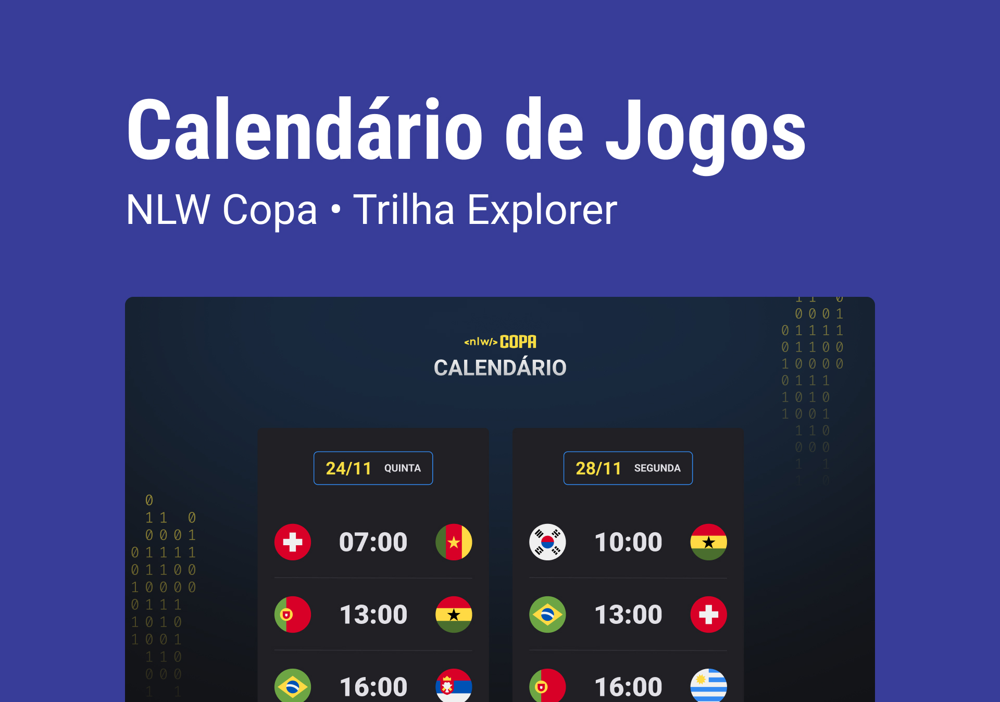

<h1 align="center"> NLW #10 Copa </h1>

Evento exclusivo e gratuito, promovido pela Rocketseat para ensino de tecnologias WEB.

    <a href="#-tecnologias">Tecnologias</a>&nbsp;&nbsp;&nbsp;|&nbsp;&nbsp;&nbsp;
    <a href="#-projeto">Projeto</a>&nbsp;&nbsp;&nbsp;|&nbsp;&nbsp;&nbsp;
    <a href="#-layout">Layout</a>&nbsp;&nbsp;&nbsp;|&nbsp;&nbsp;&nbsp;
    <a href="#memo-licença">Licença</a>

    

    

## 🚀 Tecnologias

Esse projeto foi desenvolvido com as seguintes tecnologias:

- HTML e CSS
- javascript
- Git e Github

## 💻 Projeto

O calendário da Copa é um projeto que mostra os jogos da Copa de 2022.

## 🔎 Layout

Você pode visualizar o lau=yout do projeto atravéz [DESSE LINK](https://www.figma.com/file/epMcrQcKqZ8u2poAPMtIdw/Calend%C3%A1rio-de-Jogos-(Community)-(Community)?node-id=519%3A1062&t=ufeuutUASLpHrhZZ-0/duplicate). É necessário ter conta no [Figma](https://www.figma.com) para acessa-lo 

## :memo: Licença

Esse projeto está sob a licença MIT.

### 🚧 EM BREVE
- Classificação de Grupo.
- atualização dos jogos.

